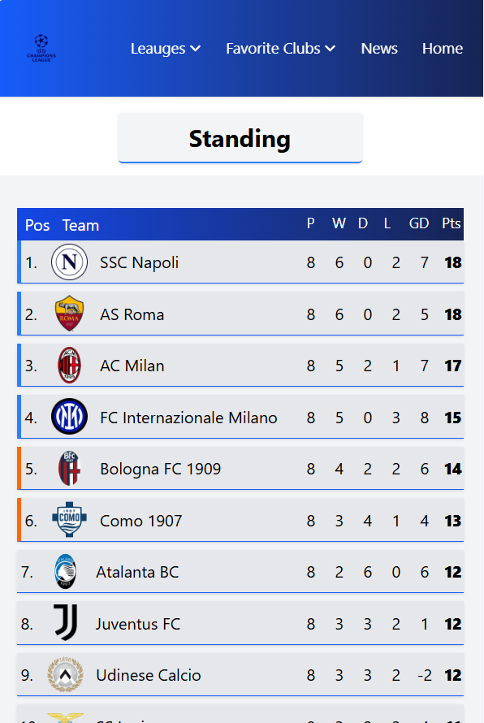

# Sport 90
A modern, responsive football statistics website built with **React** and **Tailwind CSS**, showing live league data, top scorers for every league, teams, and match results of teams.

## Preview

### - Leagues Table

### - Full Table

### - Team Data

### - News Page

### - Footer

### - Full Table in mobile screen

## Features
- Display **live league table** with rank, teams' logo, points, wins, losses, draws, goals scored, goals conceded and goals diference
- Dedicated **team pages** showing team info, matches, coach, running competitions, and players details
- **Top scorers** section for each league
- **Responsive design** for descktop, tablet, and mobile
- **Fixed header** for quick page navigation
- Error and newtwork status handling
- **Modern styling** with Tailwind CSS
- Live data fetched from **Football-Data API** via a Node.js proxy server

## Technologies Users
- **React**
- **Tailwind CSS**
- **CSS5**
- **Football-Data API**
- **Node.js** (Proxy Server)
  
## API Info
Data provided by [Football-Data.org](https://www.football-data.org)

## Contact
**Email**: mhmdzratpishh632@gmail.com
